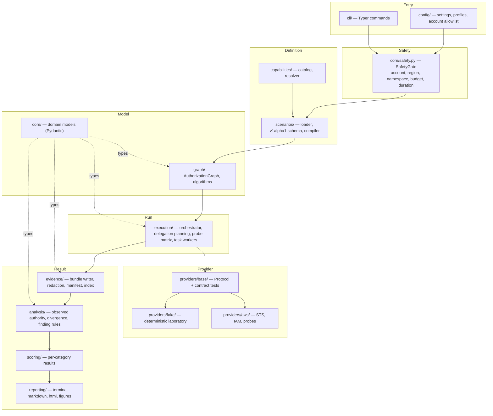
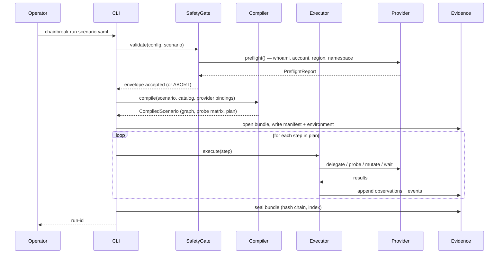

# CHAINBREAK Architecture

**Status:** authoritative for v0.1. Changes to anything marked **INVARIANT** require an ADR.

---

## 1. Design thesis

CHAINBREAK exists to produce *evidence* about authorization behavior, not opinions. Three
consequences follow, and they drive every structural decision in this document:

1. **Ground truth is empirical, not textual.** Effective authority is determined by
   attempting a benign action against a benchmark-owned resource and classifying the
   provider's response. Policy documents are recorded as context and fingerprints; they are
   never the primary source of truth for what an identity can do. Policy simulation
   (`iam:SimulatePrincipalPolicy`) is used only as a *corroborating* signal.
   (See [ADR-009](docs/adr/ADR-009-empirical-probing-over-policy-simulation.md).)

2. **Observation and conclusion are different objects with different lifetimes.** An
   `Observation` says "attempt #7 returned AccessDenied at t=1.412s". A `Finding` says
   "authority survived 37.2–39.0s past the policy change, classified REVOCATION_DELAY,
   confidence HIGH". *(Both illustrate shape, not measured values — see
   [PROJECT_STATUS.md](PROJECT_STATUS.md).)* Observations are immutable and written during
   the run; findings are derived afterward by a pure function and may be recomputed as
   analysis rules improve.
   (See [ADR-006](docs/adr/ADR-006-observation-separated-from-conclusion.md).)

3. **The benchmark engine must not know what AWS is.** Everything above the provider
   adapter boundary speaks in capabilities, identities, and delegation edges. This is the
   only reason the v0.2–v0.5 roadmap is credible.
   (See [ADR-002](docs/adr/ADR-002-capability-abstraction.md), [ADR-008](docs/adr/ADR-008-provider-adapter-boundary.md).)

---

## 2. Layer map



`delegation/` and `observation/` do not appear above: both were reserved as top-level
packages at design time but never populated (see [§3.7](#37-delegation-planning) and
[§3.12](#312-outcome-classification) for where that responsibility actually landed instead,
and `docs/DECISIONS.md` for why).

### Dependency rule (**INVARIANT ARCH-1**)

Imports may only point *downward* in this list. A violation is a build failure, enforced by
an import-linter check in CI (M0).

```
reporting  →  scoring  →  analysis  →  evidence  →  execution  →  graph  →  core
providers/aws, providers/fake  →  providers/base  →  core, capabilities
scenarios  →  capabilities, core
cli  →  everything
```

Concretely: `core/` imports nothing from CHAINBREAK. `graph/` imports only `core/`.
Nothing outside `providers/aws/` may import `boto3`. Nothing outside `providers/` may
reference an AWS action string, ARN, or service name.

---

## 3. Component contracts

### 3.1 `cli/`
Typer application. Commands: `validate`, `scenario validate|list`,
`infra plan|apply|destroy|status|verify-clean`, `run`, `analyze`, `report`, `compare`,
`evidence export`, `runs list|show|reindex`. The CLI is a thin adapter: it parses arguments,
loads config, calls the SafetyGate, and delegates. No business logic lives here.

### 3.2 `config/`
Layered configuration, later layers override earlier:
`defaults → chainbreak.toml (repo) → ~/.config/chainbreak/config.toml → CHAINBREAK_* env → CLI flags`.

The config object carries the **safety envelope**: `allowed_account_ids`, `allowed_regions`,
`namespace_prefix`, `max_run_duration_seconds`, `max_estimated_cost_usd`,
`require_confirmation_for_apply`. These are not optional; a run without a resolved safety
envelope is refused.

### 3.3 `core/`
Pure Pydantic domain models and enums. No I/O. See [AUTHORIZATION_MODEL.md](AUTHORIZATION_MODEL.md)
for semantics and `src/chainbreak/core/models.py` for the authoritative definitions.

### 3.4 `capabilities/`
The capability catalog (`catalog.yaml`) plus a resolver. A `Capability` is an abstract,
provider-neutral unit of authority (`objectstore.read`). It carries: an ID, a semantic
description, a `ProbeKind` (what shape of test proves it), a `Sensitivity` classification,
and per-provider mappings supplied by the provider package — **not** by the catalog itself.

**INVARIANT CAP-1:** A capability that no loaded provider can map is a *compile-time*
scenario error, never a silent skip.

### 3.5 `scenarios/`
Loader (YAML → `ScenarioDocument`), validator (JSON Schema + Pydantic + semantic checks),
and compiler (`ScenarioDocument` → `CompiledScenario` containing an `AuthorizationGraph`,
a `ProbeMatrix`, and an ordered `ExecutionPlan`). Compilation is pure and deterministic:
same document + same catalog version ⇒ byte-identical compiled artifact hash.

### 3.6 `graph/`
`AuthorizationGraph`: a directed acyclic graph of `IdentityNode`s joined by
`DelegationEdge`s. Nodes carry `expected_authority` (from the scenario) and, after a run,
`observed_authority` (from evidence). Algorithms in this package are pure set/graph
operations over capability sets — see [AUTHORIZATION_MODEL.md §4](AUTHORIZATION_MODEL.md#4-divergence-algorithms).

### 3.7 Delegation planning
Turning graph edges into concrete delegation requests — knowing about *mechanisms*
(`role_chain`, `session_policy`, `role_chain_with_session_policy`, `direct_role_assumption`)
abstractly, while the provider adapter knows how to execute them — is not a separate
top-level package. It lives in `execution/delegation.py` (`materialize_graph`,
`ensure_fresh_credential`, see [§3.11](#311-execution)), which walks a compiled graph's
edges in hop order and re-delegates a credential whose remaining lifetime has run down
before the matrix that is about to use it (F6). A top-level `delegation/` package was
reserved for this at design time; M10's own milestone file named `execution/delegation.py`
instead, as the more specific and more recently written source for that milestone, and the
reservation was retired rather than left as dead scaffolding (see `docs/DECISIONS.md`).

### 3.8 `providers/base/`
The adapter Protocol. Every provider must implement:

```python
class ProviderAdapter(Protocol):
    name: str
    adapter_version: str

    def preflight(self, envelope: SafetyEnvelope) -> PreflightReport: ...
    def resolve_capability(self, cap_id: CapabilityId) -> ProviderCapabilityBinding: ...
    def describe_environment(self) -> EnvironmentDescriptor: ...
    def delegate(self, request: DelegationRequest) -> DelegationResult: ...
    def probe(self, request: ProbeRequest) -> ProbeResult: ...
    def apply_policy_mutation(self, mutation: PolicyMutation) -> MutationReceipt: ...
    def snapshot_policy_state(self, identity_ref: IdentityRef) -> PolicyStateSnapshot: ...
```

Shipped alongside is a **provider contract test suite** (`tests/integration/test_provider_contract.py`)
that every adapter must pass. The fake provider passes it in CI; the AWS adapter passes it
in the opt-in `aws` layer. This is how we keep the two honest about each other.

**INVARIANT PROV-1:** An adapter may *narrow* but never *broaden* a scenario's requested
capability set. `resolve_capability` returning a binding whose provider actions exceed the
declared mapping is a hard error, checked by the binding validator.

### 3.9 `providers/fake/`
A deterministic, in-memory authorization laboratory with a full policy-evaluation model
(explicit deny > explicit allow > implicit deny), simulated credential lifetimes, and an
*injectable consistency model* so revocation-delay and stale-authority logic can be tested
without AWS. It supports seeded fault injection: `propagation_delay_ms`, `clock_skew_ms`,
`transient_error_rate`. This is what makes M10–M14 developable offline.

### 3.10 `providers/aws/`
boto3-based. Owns STS `AssumeRole` (with and without session policies), IAM policy
mutation, and the concrete probe implementations. This is the only package permitted to
name AWS services. Details in [AWS_PROVIDER_SPEC.md](AWS_PROVIDER_SPEC.md).

### 3.11 `execution/`
The run orchestrator. Responsibilities, in order:
preflight → materialize identities → walk delegation edges → run probe matrix →
execute scenario steps (mutations, waits, deferred tasks) → run post-mutation probe
matrices → teardown ephemeral state. It owns the run clock and enforces
`max_run_duration_seconds` with a hard abort. It also owns delegation planning
(`delegation.py`, [§3.7](#37-delegation-planning)) and normalized-observation construction
(`_records.py`, `matrix.py`, `control.py`, [§3.12](#312-outcome-classification)) — both
were reserved as separate top-level packages at design time and folded in here instead.

Concurrency: probes within one `ProbeMatrix` for one identity may run concurrently
(`asyncio` + bounded semaphore, default 4) **only** when the scenario declares
`timing.sensitive: false`. Timing-sensitive scenarios (revocation, stale authority) run
probes strictly serially with recorded inter-probe intervals, because concurrency destroys
the timing measurement. (See [ADR-011](docs/adr/ADR-011-serial-execution-for-timing-scenarios.md).)

### 3.12 Outcome classification
Converting a raw provider response into an `OutcomeClass` (see
[§5](#5-outcome-classification)) is not a separate top-level package either.
Classification is provider-side — each adapter classifies its own responses, because the
disambiguation rules are provider-specific: `providers/aws/disambiguation.py` for AWS's
403/404 ambiguity and denial-attribution parsing, `providers/fake/probes.py` for the fake.
Building the normalized `Observation` record (timing triple, credential, redacted response
summary) from a classified probe result plus its run context is shared code in
`execution/_records.py` (`build_observation`, see [§3.11](#311-execution)), used
identically by `execution/matrix.py`'s regular probe cells and `execution/control.py`'s
calibration probe so the two can never silently drift apart on a field. Clock handling
lives alongside it: all interval math uses `time.monotonic_ns()`; wall-clock is recorded
separately for correlation with provider-side events and carries a measured offset
estimate. A top-level `observation/` package was reserved for this at design time and
retired for the same reason as `delegation/` above.

### 3.13 `evidence/`
Writes the evidence bundle: `manifest.json`, `observations.jsonl`, `graph.json`,
`policy_states.jsonl`, `events.jsonl`, `environment.json`. Redaction is applied at the
**serialization boundary** — a single `redact()` choke point that every record passes
through — rather than at call sites. Also maintains the SQLite run index.

### 3.14 `analysis/`
Pure functions: evidence bundle → observed authority sets → divergence report → findings.
Deterministic and re-runnable: `chainbreak analyze <run>` on the same bundle always
produces the same findings for a given CHAINBREAK version, and records which version
produced them.

### 3.15 `scoring/`
Per-category results only. See [SCORING_MODEL.md](SCORING_MODEL.md).

### 3.16 `reporting/`
Terminal (rich), Markdown, and self-contained HTML. Figures generated from evidence, never
from hand-written numbers.

---

## 4. The two clocks and the two authorities

Two distinctions carry most of CHAINBREAK's analytic weight. Both are modeled explicitly.

**Authority axis**

| | Definition | Source |
|---|---|---|
| Intended authority | The capability set the scenario says an identity should hold at a point in the plan | Scenario compiler |
| Effective authority | The capability set empirically demonstrated by probe outcomes | Observation + analysis |

**Time axis**

| | Definition |
|---|---|
| Delegation-time authority | Effective authority measured immediately after the credential was issued |
| Execution-time authority | Effective authority measured at the moment the deferred task actually runs |

A scenario may therefore produce four authority sets per identity. The stale-authority and
revocation families exist entirely to populate the time axis; scope-attenuation and
delegation-drift populate the authority axis. Silent narrowing sits at the intersection of
authority and *behavior*.

---

## 5. Outcome classification

A probe never yields a boolean. It yields an `OutcomeClass`:

| Class | Meaning | Counts toward effective authority? |
|---|---|---|
| `ALLOWED` | Action performed successfully against the benchmark marker | Yes |
| `DENIED_EXPLICIT` | Provider denied and attributed the denial to an explicit deny | No |
| `DENIED_IMPLICIT` | Provider denied with no matching allow | No |
| `DENIED_UNATTRIBUTED` | Denied, but the provider did not disclose which policy type caused it | No |
| `ERROR_RESOURCE_MISSING` | Authorization passed but the target resource was absent | **Excluded** — infrastructure defect |
| `ERROR_TRANSIENT` | Throttling, timeout, 5xx | Excluded; retried per policy |
| `ERROR_INFRASTRUCTURE` | Benchmark's own setup is wrong | Excluded; raises CONFIGURATION_ERROR |
| `INDETERMINATE` | Response could not be classified | Excluded; raises INCONCLUSIVE |

Separating `ERROR_RESOURCE_MISSING` from `DENIED_*` is not pedantry. On S3, `GetObject`
against a *nonexistent* key returns `AccessDenied` (HTTP 403) rather than `NoSuchKey` when
the caller lacks `s3:ListBucket` on the bucket — so a missing benchmark marker is
indistinguishable from a denial unless the benchmark guarantees the marker exists. The AWS
adapter therefore performs a **marker precondition check** with the provisioning identity
before any read probe matrix and refuses to interpret results if markers are absent. This
is one of the highest-value correctness details in the whole system; see
[AWS_PROVIDER_SPEC.md §6](AWS_PROVIDER_SPEC.md#6-probe-catalogue-and-response-disambiguation).

---

## 6. Run lifecycle



**Sealing** computes a SHA-256 over each artifact and a Merkle-style root recorded in
`manifest.json`. A bundle whose recomputed root differs from its manifest is reported as
tampered by `chainbreak analyze` and refuses to produce findings without `--allow-unsealed`.

---

## 7. Where infrastructure comes from

There are two planes, and confusing them is a common way to build this wrong.

**Provisioned identity plane — Terraform.** Roles, trust policies, managed/inline permission
policies, buckets, tables, functions, queues, markers. Created before the run, destroyed
after. Stable, reviewable, `terraform plan`-able.

**Delegation plane — runtime STS.** `AssumeRole` calls, session policies, credential
issuance, session tagging, and *controlled policy mutations* used by the revocation family.
These are inherently per-run and cannot be expressed in Terraform.

**INVARIANT INFRA-1:** CHAINBREAK never creates an IAM *role* or attaches a *managed
policy* at runtime. Runtime mutation is limited to: `PutRolePolicy`/`DeleteRolePolicy` on
roles carrying the benchmark namespace tag, `UpdateAssumeRolePolicy` on the same, and
session-policy-scoped `AssumeRole`. Every mutation target is checked against the namespace
regex before the API call, at a single choke point in `providers/aws/mutation.py`.

**INVARIANT INFRA-2:** Every benchmark resource carries tags
`Project=CHAINBREAK`, `Environment=benchmark`, `RunID=<run-id>` (or `shared` for the
long-lived sandbox), `Namespace=<prefix>`, `ManagedBy=terraform|chainbreak-runtime`.
Cleanup tooling uses native service enumeration and exact project/namespace tags; an orphan
is findable, and an unknown or failed enumerator is unsafe rather than treated as clean.

---

## 8. Extension points (designed for, not built in v0.1)

| Future | Extension point | What v0.1 already does right |
|---|---|---|
| OIDC / workload federation (v0.2) | `DelegationMechanism` enum + `delegate()` | Mechanism is already an abstract enum, not "AssumeRole" |
| SPIFFE/SPIRE (v0.3) | New `ProviderAdapter` implementation | Identity refs are opaque `IdentityRef`, not ARNs |
| Azure (v0.4) / GCP (v0.5) | Capability catalog gains a second/third mapping table | Catalog is provider-neutral; mappings live in provider packages |
| Real LLM agents (v0.4+) | `execution/workers/` — `TaskWorker` Protocol | v0.1 workers are deterministic implementations of the same Protocol |
| MCP authorization | New capability family + probe kind | `ProbeKind` is an open enum with a registry |

**Anti-goal:** none of these may be partially implemented in v0.1. A half-built Azure
adapter is worse than none, because it makes the abstraction look validated when it is not.

---

## 9. What is deliberately excluded from v0.1

Kubernetes, service meshes, multi-cloud, a web UI, a daemon or long-running service, SIEM
integration, real LLM orchestration, distributed execution, and any form of enterprise IdP
integration. Each would add operational surface without improving the measurement. The
research artifact is the product.

---

## 10. Failure philosophy

CHAINBREAK prefers **INCONCLUSIVE** over a wrong answer. If a probe cannot be classified,
if the marker precondition fails, if the clock offset exceeds tolerance, or if a policy
mutation receipt cannot be confirmed, the affected measurement is marked inconclusive with
a machine-readable reason, and the report says so plainly. Confidence downgrades are
automatic and cannot be suppressed by a CLI flag.

A benchmark whose failure mode is a confident wrong number is worse than no benchmark.
