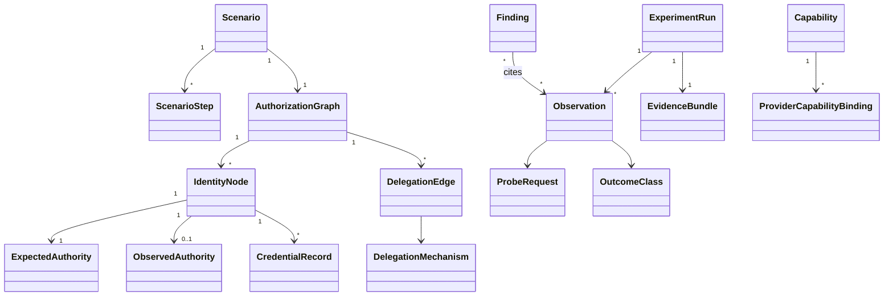
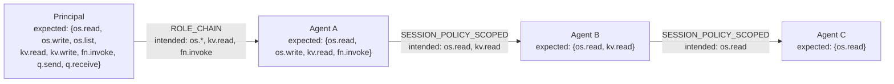

# CHAINBREAK Authorization Model

The domain model, the authorization graph, and the algorithms that turn observations into
divergence statements. Authoritative for v0.1. Code: `src/chainbreak/core/models.py`,
`src/chainbreak/graph/`.

---

## 1. Entities



### 1.1 Identity entities

**`Principal`** — the root of a chain. The identity the operator authenticates as, or a
role that stands in for a human/service origin. A graph has exactly one principal node,
marked `is_root=True`. The principal's authority is a *given*, not a measurement target,
though it is probed to establish a baseline.

**`AgentIdentity`** — a non-root identity that receives authority by delegation. In AWS
v0.1 this is an IAM role, but the model does not say so. Fields: `identity_id` (scenario-local,
e.g. `agent-b`), `identity_ref` (opaque provider handle, e.g. an ARN — populated by the
adapter), `hop_index`, `parent_id`.

**`IdentityRef`** — opaque provider-scoped handle. `{provider, kind, value, region?, account_ref?}`.
The core never parses `value`. This is what keeps ARNs out of the engine.

### 1.2 Authority entities

**`Capability`** — abstract unit of authority. See [CAPABILITY_MODEL.md](CAPABILITY_MODEL.md).

**`AuthoritySet`** — a frozen set of `CapabilityId`. All divergence math is set algebra over
these. Implemented as `frozenset[CapabilityId]` wrapped in a value object with
`__sub__`, `__and__`, `__or__` and a stable canonical ordering for hashing.

**`ExpectedAuthority`** — what the scenario says an identity should hold, at a given
`PlanPhase`. Carries `capabilities: AuthoritySet`, `phase`, and `derivation` — one of
`DECLARED` (written literally in the scenario) or `INHERITED_ATTENUATED` (computed by the
compiler as `parent_expected ∩ edge_intended`).

**`ObservedAuthority`** — what probing demonstrated. Carries `capabilities: AuthoritySet`
(only `ALLOWED` outcomes), `excluded: dict[CapabilityId, ExclusionReason]` for every
capability that could not be classified, `phase`, `probe_matrix_id`, and `coverage` =
`classified / attempted`.

**INVARIANT AUTH-1:** `ObservedAuthority.capabilities` may only contain capabilities whose
probe returned `ALLOWED`. Every other outcome is either a denial (excluded from the set) or
an exclusion (recorded in `excluded`). There is no third option and no inference.

### 1.3 Delegation entities

**`DelegationEdge`** — `source_id → target_id` with:

| Field | Meaning |
|---|---|
| `mechanism` | `DelegationMechanism` (see below) |
| `requested_capabilities` | What the source asked to pass on |
| `intended_capabilities` | What the hop is *designed* to grant (the attenuation target) |
| `credential_lifetime_s` | Requested credential duration |
| `constraints` | `DelegationConstraints` — session tags, external ID, source-identity, condition hints |
| `policy_refs` | Fingerprints of the trust policy, permission policy, and session policy in force |
| `delegated_at` | Wall-clock + monotonic timestamp of the delegation call |
| `expected_effective` | Compiler's prediction: `source.expected ∩ intended_capabilities` |

**`DelegationMechanism`** (open enum):
`DIRECT_ROLE_ASSUMPTION`, `ROLE_CHAIN`, `SESSION_POLICY_SCOPED`, `ROLE_CHAIN_WITH_SESSION_POLICY`,
`RESOURCE_POLICY_GRANT`, `FEDERATED_TOKEN` *(v0.2)*, `WORKLOAD_IDENTITY` *(v0.3)*.

**`CredentialRecord`** — metadata only, **never** the secret. `{credential_id (hash),
issued_at, expires_at, requested_duration_s, granted_duration_s, mechanism, session_name_hash,
issuing_edge_id}`. `granted_duration_s < requested_duration_s` is itself a measurable finding
(AWS silently caps chained-role sessions at 1 hour — see [AWS_PROVIDER_SPEC.md §4](AWS_PROVIDER_SPEC.md#4-delegation-mechanics-and-their-constraints)).

### 1.4 Policy entities

**`PolicyStateSnapshot`** — `{identity_ref, taken_at, policy_documents: list[PolicyFingerprint], provider_version_markers}`.

**`PolicyFingerprint`** — `{policy_kind, name_hash, sha256_of_canonical_json, statement_count, has_explicit_deny}`.
The **canonical JSON** normalization (sorted keys, sorted single-element arrays unwrapped,
whitespace stripped) makes fingerprints comparable across reads. Full policy documents are
stored only when `evidence.include_policy_documents: true`, which defaults to **false**
because policy documents can name real account infrastructure.

**`PolicyMutation`** — a controlled change applied during a run: `{target, kind, payload_ref, requested_at, receipt}`.
Kinds: `ATTACH_INLINE_DENY`, `REMOVE_INLINE_POLICY`, `REPLACE_INLINE_POLICY`,
`UPDATE_TRUST_POLICY`, `REVOKE_OLDER_SESSIONS`, `DELETE_SESSION_POLICY_SCOPE`.

---

## 2. The authorization graph

A rooted DAG. Nodes are identities; edges are delegations.



**Graph invariants, checked at compile time:**

- **G-1 Acyclic.** Delegation cycles are rejected. (A cycle would make "hop index" and
  "first divergence" meaningless.)
- **G-2 Single root.** Exactly one node with no inbound edge.
- **G-3 Monotone intent.** For every edge, `intended_capabilities ⊆ source.expected_authority`.
  A scenario that *intends* to grant a child more than the parent has is a scenario bug —
  unless the scenario explicitly declares `negative_control: {kind: INTENT_EXCEEDS_PARENT}`,
  in which case the check is downgraded to a recorded warning and the run proceeds. This is
  how negative controls opt out of a guardrail without disabling it globally.
- **G-4 Capability closure.** Every capability named anywhere resolves in the loaded catalog
  and has a binding in the active provider.
- **G-5 Bounded depth.** `depth ≤ config.max_delegation_depth` (default 6). Long chains are
  a research variable, not an accident; exceeding the bound requires an explicit scenario field.

**Expected-authority derivation.** For a non-root node with inbound edge `e` from `s`:

```
node.expected_authority = s.expected_authority ∩ e.intended_capabilities
```

Intersection, not assignment. If the scenario also declares an explicit
`expected_capabilities` on the node, the compiler asserts the two agree and fails on
mismatch, naming both values. Redundant declaration is allowed because it makes scenarios
self-documenting and catches compiler regressions.

---

## 3. Probe matrices

A `ProbeMatrix` is the cartesian product `{identity} × {capabilities under test}` at a given
`PlanPhase`, plus scheduling metadata.

**Which capabilities are under test?** By default, the union of every capability named
anywhere in the scenario — *not* just the ones the node is expected to hold. This is
essential: you cannot detect authority expansion by only testing for authority you expect.
Scenarios may narrow this with `probe.universe: declared|scenario|catalog`, defaulting to
`scenario`.

**`PlanPhase`** values: `BASELINE`, `POST_DELEGATION`, `PRE_MUTATION`, `POST_MUTATION`,
`DEFERRED_EXECUTION`, `POST_EXPIRY`, `FINAL`.

**Repetition.** Each cell runs `trials` times (default 3 for authority-axis scenarios; for
timing scenarios repetition is replaced by polling, see §5). A cell is `ALLOWED` only if
**all** trials are `ALLOWED`; mixed results produce `INDETERMINATE` with the trial vector
recorded. Unanimity is the conservative choice: it prevents a single throttled request from
being read as a denial.

---

## 4. Divergence algorithms

All operate on `AuthoritySet`s. All are pure. All are in `graph/divergence.py`.

### 4.1 Per-node divergence

```
expected = node.expected_authority.capabilities
observed = node.observed_authority.capabilities

unexpected_gain     = observed - expected          # authority that should not exist
unexpected_loss     = expected - observed          # authority that should exist but doesn't
agreement           = observed & expected
coverage            = node.observed_authority.coverage
```

`unexpected_gain ≠ ∅` → candidate `AUTHORITY_EXPANSION`.
`unexpected_loss ≠ ∅` → candidate `AUTHORITY_NARROWING`.
Both are *candidates*: promotion to a finding requires the confidence rules in §6.

### 4.2 Per-edge divergence (attenuation correctness)

```
src_obs   = edge.source.observed_authority.capabilities
intended  = edge.intended_capabilities
dst_obs   = edge.target.observed_authority.capabilities

expected_at_target   = src_obs & intended
attenuation_correct  = (dst_obs == expected_at_target)

survived_incorrectly = dst_obs - intended        # target holds authority the hop never intended
dropped_incorrectly  = expected_at_target - dst_obs
```

Note the deliberate use of `src_obs` (observed) rather than `src_expected`. Evaluating a hop
against what the parent *actually* had isolates that hop's behavior from upstream drift.
Both are computed and reported; the observed-based one drives the edge verdict, the
expected-based one drives chain-level drift attribution.

`survived_incorrectly ≠ ∅` → candidate `AUTHORITY_SURVIVAL`.

### 4.3 First divergence hop

```python
def first_divergence(chain: list[IdentityNode]) -> DivergencePoint | None:
    for hop_index, node in enumerate(chain):
        if node.observed_authority is None:
            return DivergencePoint(hop_index, kind=UNMEASURED)
        if node.observed_authority.capabilities != node.expected_authority.capabilities:
            return DivergencePoint(
                hop_index,
                kind=EXPANSION if gain else NARROWING if loss else MIXED,
                gain=gain,
                loss=loss,
            )
    return None
```

Reported per root-to-leaf path. For branching graphs, each path is analyzed independently
and the report lists divergence per path.

### 4.4 Drift propagation classification

For each node downstream of a divergence point, drift is classified as:

- **`ORIGINATED`** — divergence first appears at this node and is not explained by the parent.
  Formally: `gain(node) ⊄ gain(parent)`.
- **`PROPAGATED`** — `gain(node) ⊆ gain(parent)`. The node inherited someone else's problem.
- **`AMPLIFIED`** — `gain(node) ⊃ gain(parent)` and `gain(parent) ≠ ∅`. Both inherited and added.
- **`CORRECTED`** — `gain(parent) ≠ ∅` and `gain(node) = ∅`. The hop cleaned up upstream drift.

`CORRECTED` matters: it is the difference between "the system is broken" and "the system is
defense-in-depth working as designed", and a benchmark that cannot express it will produce
alarmist output.

### 4.5 Chain summary

Per path: `[(hop, |intended|, |expected|, |observed|, gain, loss, drift_class)]`, plus
`first_divergence`, `terminal_gain`, and `attenuation_monotone` — whether
`|observed(h₀)| ≥ |observed(h₁)| ≥ … ≥ |observed(hₙ)|`. Non-monotone cardinality is a strong
signal but not a conclusion, since capability *sets* can differ without cardinality doing so.
Set-level monotonicity (`observed(hᵢ₊₁) ⊆ observed(hᵢ)`) is checked separately and is the
stronger property.

---

## 5. Temporal authority model

### 5.1 Revocation measurement

Given a mutation `M` applied at monotonic instant `t_M` (receipt-confirmed), and a serial
poll sequence `p₀ … pₙ` of one capability with outcomes:

```
t_last_allow   = max{ t(pᵢ) : outcome(pᵢ) = ALLOWED }
t_first_deny   = min{ t(pⱼ) : outcome(pⱼ) ∈ {DENIED_*} and t(pⱼ) > t_last_allow }

transition_window        = [t_last_allow - t_M, t_first_deny - t_M]
point_estimate           = midpoint(transition_window)
uncertainty_half_width   = (t_first_deny - t_last_allow) / 2
```

**Reported as an interval, never as a single number.** The interval width is bounded by the
polling period, which is a controlled variable (default 500 ms, configurable). Additional
recorded uncertainty sources: request round-trip time (each poll records its own RTT), the
mutation receipt's own latency, and — critically — the fact that the receipt confirms the
*control-plane write*, not global propagation.

Flip-flop handling: if any `ALLOWED` occurs after `t_first_deny`, the measurement is marked
`NON_MONOTONIC_TRANSITION` and reported with the full outcome timeline. This is a
scientifically interesting result (eventual-consistency oscillation), so it is preserved
rather than smoothed away.

Termination: polling stops at `min(observed stable denial for k=3 consecutive polls,
credential expiry, scenario timeout)`. If polling ends without a denial, the result is
`NO_TRANSITION_OBSERVED_WITHIN_WINDOW` with the window length — an honest negative, not a PASS.

### 5.2 Stale authority classification

A deferred task holds a credential issued at `t_issue`. A policy change occurs at `t_M`.
The task executes at `t_exec`, with `t_issue < t_M < t_exec`. The outcome classifies the
execution-time authority state:

| Observed at `t_exec` | Classification | Interpretation |
|---|---|---|
| Denied, consistent with post-mutation policy | `CURRENT_AUTHORITY` | Authorization re-evaluated at use time |
| Allowed, consistent with pre-mutation policy, credential unexpired | `STALE_AUTHORITY_LIVE_CREDENTIAL` | Old grant still honored |
| Allowed, credential past `expires_at` | `EXPIRED_CREDENTIAL_HONORED` | Serious; would warrant escalation |
| Denied with expiry error | `CREDENTIAL_EXPIRED` | Expected lifetime behavior |
| Allowed, but a session-policy scope was removed | `SESSION_SCOPE_CACHED` | Scope evaluated at issuance only |
| Any other combination | `INDETERMINATE` | Recorded verbatim |

`STALE_AUTHORITY_LIVE_CREDENTIAL` is the *documented, expected* behavior of bearer-token
systems including STS. CHAINBREAK reports it as a measurement with a plain-language note
that this is by design, and reports the *duration* of the stale window as the interesting
quantity. Framing it as a vulnerability would be wrong and would discredit the benchmark.

### 5.3 Credential lifetime

Recorded per credential: requested vs granted duration, actual first-failure-after-expiry
time, and clock skew between issuer-reported `expires_at` and local observation. A granted
duration below the requested one is recorded as `LIFETIME_CAPPED` with the cap value — this
reliably surfaces the 1-hour role-chaining ceiling and any `MaxSessionDuration` limits.

---

## 6. From divergence to finding

A divergence candidate becomes a `Finding` only after passing the confidence gate:

```
confidence = HIGH   if coverage == 1.0
                    and all contributing cells unanimous across trials
                    and no ERROR_* outcomes in the matrix
                    and policy state snapshot succeeded before and after
           = MEDIUM if coverage >= 0.9 and no INDETERMINATE in contributing cells
           = LOW    if coverage >= 0.7
           = INSUFFICIENT otherwise -> finding type becomes INCONCLUSIVE
```

Findings carry `observation_refs` (the exact observation IDs that produced them), so every
sentence in a report is traceable to a probe. See [EVIDENCE_SCHEMA.md](EVIDENCE_SCHEMA.md).

**Finding types** and their triggering predicates:

| Type | Predicate |
|---|---|
| `EXPECTED_BEHAVIOR` | `observed == expected` at every measured node |
| `AUTHORITY_EXPANSION` | `unexpected_gain ≠ ∅` at a node |
| `AUTHORITY_SURVIVAL` | `survived_incorrectly ≠ ∅` on an edge |
| `AUTHORITY_NARROWING` | `unexpected_loss ≠ ∅` at a node |
| `DELEGATION_DRIFT` | divergence at hop `i > 0` with a defined drift class |
| `REVOCATION_DELAY` | `transition_window` lower bound > `config.revocation_expectation_s` |
| `STALE_AUTHORITY` | classification ∈ {`STALE_AUTHORITY_LIVE_CREDENTIAL`, `SESSION_SCOPE_CACHED`} |
| `EXPIRED_CREDENTIAL_ACCEPTED` | classification = `EXPIRED_CREDENTIAL_HONORED` |
| `SILENT_NARROWING` | task reported success while `required ⊄ observed` |
| `LIFETIME_CAPPED` | `granted_duration < requested_duration` |
| `INCONCLUSIVE` | confidence gate failed |
| `EXECUTION_ERROR` | orchestration failed |
| `CONFIGURATION_ERROR` | benchmark's own setup invalid (markers missing, binding mismatch) |
| `DETECTOR_FAILURE` | a negative control's declared `expect_finding` was **not** produced |

`DETECTOR_FAILURE` is the most important type in the taxonomy. It is the only one that says
something about CHAINBREAK rather than about the system under test, and it is the reason
negative controls exist.

---

## 7. Worked example

Scenario `delegation-drift/four-hop.yaml`, capability shorthand: `os`=objectstore, `kv`=keyvalue, `fn`=function.

| Hop | Identity | Intended (edge) | Expected (derived) | Observed | Gain | Loss | Drift |
|---|---|---|---|---|---|---|---|
| 0 | principal | — | os.read, os.write, os.list, kv.read, kv.write, fn.invoke | same (6) | ∅ | ∅ | — |
| 1 | agent-a | os.*, kv.read, fn.invoke | os.read, os.write, os.list, kv.read, fn.invoke (5) | same (5) | ∅ | ∅ | none |
| 2 | agent-b | os.read, kv.read | os.read, kv.read (2) | os.read, kv.read (2) | ∅ | ∅ | none |
| 3 | agent-c | os.read | os.read (1) | os.read, kv.read (2) | {kv.read} | ∅ | **ORIGINATED** |
| 4 | agent-d | os.read | os.read (1) | os.read, kv.read (2) | {kv.read} | ∅ | PROPAGATED |

First divergence: hop 3. Findings: one `AUTHORITY_EXPANSION` at agent-c (confidence HIGH),
one `DELEGATION_DRIFT` with `drift_class=PROPAGATED` at agent-d citing the hop-3 finding as
its cause. The report names hop 3 as the remediation target and explicitly does **not**
raise an independent alarm at hop 4.

The numbers above are an illustration of the algorithm, not a measured result. No AWS run
has been performed. See [PROJECT_STATUS.md](PROJECT_STATUS.md).
