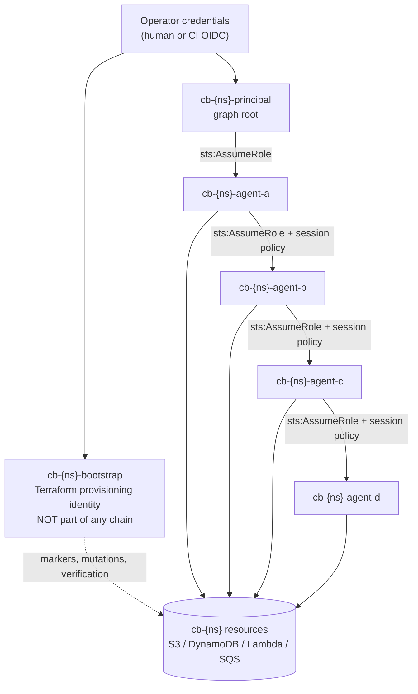

# CHAINBREAK AWS Provider Specification

The only document in this repository permitted to name AWS services.
Code: `src/chainbreak/providers/aws/`. Infrastructure: `infra/terraform/`.

---

## 1. Scope

The AWS adapter implements the `ProviderAdapter` Protocol using IAM, STS, S3, DynamoDB,
Lambda, and SQS. It is responsible for four things and nothing else:

1. Resolving abstract identities and capabilities to real ARNs and API calls.
2. Executing delegations via STS.
3. Executing probes and classifying their responses.
4. Applying controlled policy mutations to benchmark-owned roles.

It is **not** responsible for provisioning. Roles, policies, buckets, tables, functions and
queues come from Terraform (see [§8](#8-terraform-contract)). The adapter reads Terraform
outputs and refuses to run if they are absent or malformed.

---

## 2. Preflight — the gate before anything else happens

`preflight(envelope)` runs before a single benchmark API call and must pass every check:

| # | Check | Failure mode |
|---|---|---|
| P1 | `sts:GetCallerIdentity` succeeds | `ABORT` — no usable credentials |
| P2 | Returned `Account` ∈ `config.allowed_account_ids` | `ABORT` — **wrong account** |
| P3 | Session region ∈ `config.allowed_regions` | `ABORT` |
| P4 | Partition is `aws` (not `aws-cn`/`aws-us-gov`) unless explicitly configured | `ABORT` |
| P5 | Terraform outputs load and every required output is present | `ABORT` |
| P6 | Every resolved ARN matches `^arn:aws:[a-z0-9-]+:[a-z0-9-]*:\d{12}:.*cb-[0-9a-z]{8}` | `ABORT` |
| P7 | Every benchmark resource carries `Project=CHAINBREAK` and matching `Namespace` tag | `ABORT` |
| P8 | Marker preconditions satisfied (marker object, marker item, function alive, queue exists) | `CONFIGURATION_ERROR` |
| P9 | The account contains no resource tagged `Environment=production` | `WARN` + require `--i-know-what-i-am-doing` |
| P10 | Estimated run cost ≤ `config.max_estimated_cost_usd` | `ABORT` |
| P11 | Clock offset within tolerance | `WARN` + downgrade timing confidence |

P2 is the single most important line of code in the project. It is implemented once, in
`providers/aws/preflight.py`, and `tests/unit/test_safety_gate.py` asserts that an account
mismatch raises before any other AWS call is issued — verified by asserting the botocore
call log contains exactly one entry (`GetCallerIdentity`).

P9 exists because the most likely real-world accident is an operator pointing CHAINBREAK at
an account that is *mostly* a sandbox.

---

## 3. Identity architecture



Four identity classes with strictly separated purposes:

**Operator credentials.** Whatever the human or CI uses. Never used for probes. Used only to
assume `bootstrap` and `principal`.

**Bootstrap role (`cb-{ns}-bootstrap`).** Holds the authority to write markers, verify
preconditions, snapshot policy state, and apply policy mutations. It is deliberately *not*
a node in any authorization graph, because an identity that can rewrite policy must never be
a measurement subject — that would make its own probe results meaningless. Its permissions
are scoped by an IAM `Condition` on `aws:ResourceTag/Namespace`.

**Principal role (`cb-{ns}-principal`).** The graph root. Holds the union of capabilities
any scenario needs. It cannot mutate policy.

**Agent roles (`cb-{ns}-agent-{a..f}`).** The measurement subjects. Six are provisioned so
scenarios up to depth 6 need no re-apply.

### Trust policies

Each agent role trusts *only* its designated predecessor plus the bootstrap role (for
snapshotting), with an `sts:ExternalId` condition bound to the namespace:

```json
{
  "Version": "2012-10-17",
  "Statement": [{
    "Effect": "Allow",
    "Principal": {"AWS": [
      "arn:aws:iam::${account}:role/cb-${ns}-agent-a",
      "arn:aws:iam::${account}:role/cb-${ns}-bootstrap"
    ]},
    "Action": "sts:AssumeRole",
    "Condition": {
      "StringEquals": {"sts:ExternalId": "cb-${ns}"},
      "StringLike":   {"sts:RoleSessionName": "cb-${ns}-*"}
    }
  }]
}
```

The `RoleSessionName` condition means every benchmark session is identifiable in CloudTrail
by name, which is what makes provider-side corroboration possible (§9).

---

## 4. Delegation mechanics and their constraints

| Mechanism | STS call | Real constraint the benchmark must respect |
|---|---|---|
| `DIRECT_ROLE_ASSUMPTION` | `AssumeRole` from a long-lived identity | `DurationSeconds ≤ role.MaxSessionDuration` (1–12 h) |
| `ROLE_CHAIN` | `AssumeRole` using credentials that are themselves from `AssumeRole` | **`DurationSeconds` is capped at 3600 s and a longer request is rejected** |
| `SESSION_POLICY_SCOPED` | `AssumeRole` with `Policy=` | Session policy **intersects** with the role's identity policy; it cannot grant |
| `ROLE_CHAIN_WITH_SESSION_POLICY` | both of the above | Both constraints apply |
| `RESOURCE_POLICY_GRANT` | resource policy on the bucket/queue | Resource policies can grant across the intersection; a documented asymmetry |

Two of these are research-relevant, not just trivia:

**The 3600 s chaining cap** means any scenario requesting a longer lifetime on a chained hop
will be *silently satisfied with less* if the code does not check. The adapter compares
requested vs granted on every delegation and emits `LIFETIME_CAPPED`. This is a real,
measurable instance of "the policy did not do what the author thought" — exactly what
CHAINBREAK exists to catch.

**Session policies intersect, never grant.** This makes `SESSION_POLICY_SCOPED` the correct
primary attenuation mechanism for the scope-attenuation family: it *should* be impossible
for a session policy to expand authority. A scenario that observes expansion under a session
policy has found something genuinely surprising — which is precisely why the negative
control for that family injects the expansion via the role's own identity policy instead,
producing the same observable outcome through a mechanism we know works.

**Session policy synthesis.** For `derive_from: intended_capabilities`, the adapter builds:

```json
{"Version":"2012-10-17","Statement":[
 {"Sid":"CbAllowIntended","Effect":"Allow",
  "Action":["s3:GetObject"],
  "Resource":["arn:aws:s3:::cb-${ns}-objectstore/cb-${ns}/markers/*"]},
 {"Sid":"CbAlwaysWhoami","Effect":"Allow","Action":["sts:GetCallerIdentity"],"Resource":"*"}
]}
```

Generated from binding metadata only — never hand-written per scenario. Size matters: the
session policy JSON must stay under 2048 characters, which with ten capabilities is
comfortable but is asserted at compile time with a clear error rather than discovered as an
STS `PackedPolicyTooLarge` at runtime.

### Revocation mechanisms — the independent variable of the revocation family

| Mechanism | API | What it should affect | Notes |
|---|---|---|---|
| `ATTACH_INLINE_DENY` | `iam:PutRolePolicy` | Future *and existing* sessions | Explicit deny wins everywhere |
| `REMOVE_INLINE_POLICY` | `iam:DeleteRolePolicy` | Removes an allow | Implicit denial afterward |
| `UPDATE_TRUST_POLICY` | `iam:UpdateAssumeRolePolicy` | Future `AssumeRole` only | Should **not** affect live sessions |
| `REVOKE_OLDER_SESSIONS` | `iam:PutRolePolicy` with `aws:TokenIssueTime` deny | Existing sessions only | The documented AWS session-revocation pattern |
| `DELETE_SESSION_POLICY_SCOPE` | n/a — re-delegate without the scope | Next credential only | Control for "scope is issuance-time" |

Running the same scenario across all five mechanisms is the core revocation experiment.
`UPDATE_TRUST_POLICY` functions as a **built-in negative control**: it is expected *not* to
revoke a live session, so if CHAINBREAK reports a fast transition there, the measurement
apparatus is wrong.

---

## 5. Benchmark resources

| Resource | Name | Purpose | Cost posture |
|---|---|---|---|
| S3 bucket | `cb-{ns}-objectstore` | markers + run-scoped scratch | Free tier; lifecycle rule expires `scratch/` after 1 day |
| DynamoDB table | `cb-{ns}-keyvalue` | marker item + scratch items | **On-demand billing**; TTL attribute on scratch items |
| Lambda function | `cb-{ns}-noop` | invoke target; returns `{"ok":true}` | 128 MB, `python3.12`, no VPC, no layers |
| SQS queue | `cb-{ns}-queue` | send/receive probes | Standard queue, `VisibilityTimeout=0` |
| CloudWatch log group | `/aws/lambda/cb-{ns}-noop` | 1-day retention | Explicit retention so logs do not accumulate |
| CloudTrail (optional) | `cb-{ns}-trail` | provider-side corroboration | **Off by default**; management events only |

Object key layout:

```
cb-{ns}/markers/marker.json           # written by bootstrap at apply time, read by probes
cb-{ns}/scratch/{run_id}/{probe_id}   # written by BENIGN_WRITE probes, lifecycle-expired
```

DynamoDB item layout: `pk = "cb-marker"` for the read marker;
`pk = "cb-scratch#{run_id}#{probe_id}"` with a `ttl` attribute for writes.

Every write probe is confined to the run-scoped prefix by the binding's resource template,
and the identity policies additionally constrain writes with a `Condition` on
`s3:prefix` / `dynamodb:LeadingKeys`. Two independent controls, because prefix confinement
is what prevents cross-run contamination.

---

## 6. Probe catalogue and response disambiguation

This section is where correctness is won or lost.

### 6.1 The 403/404 problem

`s3:GetObject` on a **nonexistent** key returns `404 NoSuchKey` if the caller holds
`s3:ListBucket` on the bucket, and `403 AccessDenied` if it does not. An agent under test
generally will not hold `ListBucket`. Therefore, for an agent that *is* authorized to read
but whose marker is missing, S3 returns **the same error as a denial**.

Consequence: without a precondition guarantee, `objectstore.read` cannot be measured at all.

Mitigations, all three applied:

1. **Precondition verification.** Before any read matrix, the bootstrap identity performs
   `HeadObject` on the marker and asserts a matching ETag. Failure ⇒ the entire matrix is
   `CONFIGURATION_ERROR`, never a set of denials.
2. **Content verification on success.** A probe is `ALLOWED` only if the returned body's
   SHA-256 matches the expected marker digest. "No exception" is not success.
3. **Message-shape classification.** AWS denial messages are parsed for the phrase
   distinguishing explicit deny (`with an explicit deny in a(n) ... policy`) from implicit
   denial. The parse result populates `denial_attribution`; when the phrase is absent the
   class is `DENIED_UNATTRIBUTED`, not a guess.

### 6.2 Probe table

| Capability | API call | ALLOWED iff | Denial codes | Disambiguation hazard |
|---|---|---|---|---|
| `objectstore.read` | `GetObject` | body SHA-256 == expected | `AccessDenied` | 403 vs 404 (above) |
| `objectstore.write` | `PutObject` to run scratch | 200 **and** `HeadObject` confirms | `AccessDenied` | none significant |
| `objectstore.list` | `ListObjectsV2` prefix=`cb-{ns}/markers/` | ≥1 key returned | `AccessDenied` | empty-but-allowed ⇒ precondition guarantees ≥1 |
| `keyvalue.read` | `GetItem` (ConsistentRead=true) | item present and digest matches | `AccessDeniedException` | missing item returns 200 + empty ⇒ precondition required |
| `keyvalue.write` | `PutItem` scratch key | 200 **and** `GetItem` confirms | `AccessDeniedException` | none significant |
| `function.invoke` | `Invoke` (RequestResponse) | payload == `{"ok":true,"nonce":…}` | `AccessDeniedException` | **`StatusCode:200` with `FunctionError` is a function fault, not a denial** |
| `queue.send` | `SendMessage` | `MessageId` returned | `AccessDenied` | none significant |
| `queue.receive` | `ReceiveMessage` VisibilityTimeout=0 | HTTP 200 (empty receive still proves authority) | `AccessDenied` | empty result is ALLOWED here |
| `identity.whoami` | `sts:GetCallerIdentity` | ARN returned | *never denied by IAM policy* | control capability |
| `identity.delegate` | `sts:AssumeRole` on next hop | credentials returned | `AccessDenied` | trust-policy denial vs permission denial — both `DENIED_*`, attribution recorded |

`queue.receive` returning zero messages counts as `ALLOWED` because the API call itself
succeeded; this is noted in the binding to prevent a future maintainer from "fixing" it.

`identity.whoami` is never denied by an identity policy — that is exactly why it is the
control. If it fails, the failure is credentials, network, or endpoint, and the run aborts
rather than reporting a wave of false denials.

### 6.3 Retry policy

Transient classes (`Throttling`, `ThrottlingException`, `RequestLimitExceeded`, `500`,
`503`, connection errors) retry up to 3 times with full-jitter exponential backoff (base
200 ms, cap 2 s). **Retries are recorded**, count against the trial's timing, and any probe
that required a retry is flagged so timing findings can be filtered on it. `AccessDenied` is
never retried — retrying a denial would be the classic way to accidentally manufacture a
timing artifact.

### 6.4 Corroboration via policy simulation

After each probe matrix, the adapter optionally calls `iam:SimulatePrincipalPolicy` for the
same (principal, action, resource) triples. Results are stored in a separate
`simulations.jsonl` and **never** feed `ObservedAuthority`. Their value is diagnostic:
disagreement between simulation and empirical result is itself interesting and is surfaced
as an `INCONCLUSIVE`-adjacent note. Off by default (extra API calls, extra cost surface).
Rationale in [ADR-009](docs/adr/ADR-009-empirical-probing-over-policy-simulation.md).

---

## 7. Mutation choke point

All policy mutations pass through one function:

```python
def apply_mutation(self, mutation: PolicyMutation) -> MutationReceipt:
    assert_namespace(mutation.target_arn, self.envelope)       # regex + tag lookup
    assert_role_is_benchmark_agent(mutation.target_arn)        # not bootstrap, not principal
    assert_mutation_kind_allowed(mutation.kind, self.envelope)
    before = self.snapshot_policy_state(mutation.target)
    t0 = monotonic_ns()
    response = self._call(mutation)                            # PutRolePolicy / etc.
    after, confirm_latency = self._read_after_write(mutation)  # poll until document matches
    return MutationReceipt(confirmed=(after == expected), t_applied=t0, ...)
```

`assert_role_is_benchmark_agent` refuses to mutate `bootstrap` or `principal`. A benchmark
that can revoke its own ability to observe is a benchmark that produces garbage.

`_read_after_write` polls `GetRolePolicy` until the returned document matches what was
written, up to 10 s. The `t_M` anchor recorded for timing analysis is `t0` (request send),
and `confirmation_latency_ms` is recorded separately, so the analysis can report the
transition window relative to either anchor and state which it used.

---

## 8. Terraform contract

```
infra/terraform/
├── modules/
│   ├── benchmark-account/   # account-level guardrails, budget alarm, namespace generation
│   ├── identities/          # bootstrap, principal, agent-{a..f}; trust + permission policies
│   ├── resources/           # S3, DynamoDB, Lambda, SQS, markers, lifecycle rules
│   ├── delegation/          # per-hop permission policies expressing intended capabilities
│   └── observability/       # optional CloudTrail + log groups (default off)
└── environments/
    ├── local-development/   # LocalStack-compatible; no real AWS calls
    └── aws-sandbox/         # the real benchmark environment
```

**Required outputs** (consumed by `preflight` P5; names are a stable contract):

```
namespace, account_id, region,
bootstrap_role_arn, principal_role_arn,
agent_a_role_arn … agent_f_role_arn,
objectstore_bucket, objectstore_marker_key, objectstore_marker_sha256,
keyvalue_table, keyvalue_marker_pk, keyvalue_marker_sha256,
function_name, queue_url,
external_id, infrastructure_fingerprint
```

Adding an output is a minor change; removing or renaming one is breaking and requires a
`infrastructure_profile` version bump in scenarios that depend on it.

**Namespace generation.** `namespace = "cb-" + substr(sha1(account_id + workspace + salt), 0, 8)`,
stable across applies within a workspace so scenarios do not need re-compilation, and
distinct across workspaces so two operators in one account cannot collide.

**Tags** applied via `default_tags` on the provider:
`Project=CHAINBREAK`, `Environment=benchmark`, `Namespace={namespace}`, `ManagedBy=terraform`,
`AutoDelete=true`.

**Destruction.** `terraform destroy` must succeed with zero manual steps. Two things
normally break this and are handled explicitly: the S3 bucket uses `force_destroy = true`
(safe — it only ever holds markers and scratch), and the CloudWatch log group is managed
explicitly so Lambda's implicit group does not orphan. A `chainbreak infra verify-clean`
command lists every resource tagged `Project=CHAINBREAK` remaining in the account, so
"destroy succeeded" is verified rather than assumed.

---

## 9. Cost model

Per full suite (≈500 probes, 6 roles, ~40 delegations, 20 min wall clock):

| Service | Usage | Cost |
|---|---|---|
| STS | ~60 `AssumeRole` | $0.00 (free) |
| IAM | ~40 read/write | $0.00 (free) |
| S3 | ~300 GET, ~100 PUT, <1 MB stored | < $0.01 |
| DynamoDB on-demand | ~200 reads, ~100 writes | < $0.01 |
| Lambda | ~100 invocations, 128 MB, <100 ms | $0.00 (free tier) |
| SQS | ~200 requests | $0.00 (first 1 M free) |
| CloudWatch Logs | < 1 MB, 1-day retention | < $0.01 |
| CloudTrail (if enabled) | management events, first trail | $0.00 |
| **Total** | | **well under $0.10** |

Guards: `max_estimated_cost_usd` (default $1.00) checked in preflight against a static
per-probe cost table; `max_run_duration_seconds` hard abort; an AWS Budgets alarm at $5 in
the `benchmark-account` module; DynamoDB on-demand rather than provisioned (provisioned
capacity is the single most likely way to accidentally spend money here); explicit log
retention everywhere.

The dominant real cost risk is not per-request pricing — it is **forgetting to destroy**.
Hence `verify-clean`, the `AutoDelete=true` tag, and the 1-day lifecycle rules that bound
storage even on an orphaned bucket.

---

## 10. Known AWS behaviors the benchmark must not misreport

Recorded here so that findings can cite them rather than "discovering" documented behavior:

1. **IAM is eventually consistent.** Policy changes are not guaranteed instantly global.
   Measuring a nonzero propagation interval is *expected*; the measurement is the
   contribution, not the surprise.
2. **STS credentials are bearer tokens.** They remain valid until expiry unless explicitly
   denied. Stale authority on a live credential is by design, and the report says so.
3. **Session policies intersect.** They cannot grant. Observed "expansion" under a session
   policy almost certainly means the role's own policy is the source.
4. **Role chaining caps at 1 hour** and silently grants less than requested.
5. **`sts:GetCallerIdentity` cannot be denied** by an identity policy.
6. **Explicit deny always wins**, including over resource policies and session policies.
7. **The global STS endpoint vs regional endpoints** can differ in propagation behavior. The
   adapter pins a regional endpoint (`sts.{region}.amazonaws.com`) and records it, because
   mixing endpoints across a timing experiment would introduce an uncontrolled variable.

Every one of these appears in the report's "expected provider behavior" appendix whenever a
related finding is emitted.
