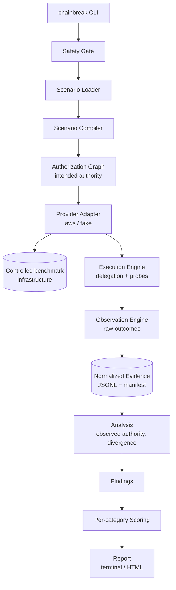

# CHAINBREAK

**An empirical benchmark for authorization behavior in delegated and agentic cloud systems.**

CHAINBREAK measures the gap between the authority a security policy *intended* to grant
and the authority a delegated workload *actually* holds when it executes.

> **Status: release candidate pending owner decision — M0–M16 are complete, including
> dedicated-account acceptance for M8/M9. Three valid real-AWS M17 blocks completed on
> 2026-08-18 (`n=32`, `n=23`, `n=32`), with all six negative controls `DETECTOR_OK`, complete
> analysis/export, and exact cleanup. M18 compare/archive/migration was exercised on valid
> AWS bundles, including honest lower-confidence cross-operator and heterogeneous behavior.
> The release gate remains pending the owner/admin IAM cleanup and final history/publication
> decision. No tag, history rewrite, force-push, GitHub release, or publication was made.**
> The domain model, divergence algorithms, capability catalog, binding registry, operation
> allowlist, the full five-stage scenario validation pipeline and compiler, layered
> configuration resolution, the SafetyGate, the full `chainbreak` CLI, a real deterministic
> fake authorization engine (policy evaluation, session lifetimes, an injectable consistency
> model, all 10 capability bindings), the evidence pipeline (append-only sealed bundles,
> a `redact()` choke point at exactly 100% coverage, a SQLite run index, and a bounded reader
> and public-export scrub for untrusted bundles), the analysis pipeline (unanimity-based
> cell resolution, divergence/drift classification with cause citation surviving any number
> of propagated hops, first-divergence-per-path, the revocation-window and stale-authority
> math, the confidence gate, one rule per finding type, the negative-control detector, and
> `chainbreak analyze` turning a sealed bundle into `findings.json`, now including
> stale-authority and silent-narrowing findings extracted automatically from any bundle), the
> `TaskWorker` Protocol and four deterministic workers (honest, always-claims-complete,
> capability-substituting, redelegation-attempting) with independent bootstrap-attributed
> output-marker verification never trusting a worker's self-report, the AWS provider
> adapter (preflight P1–P11, STS delegation for all five mechanisms, the ten capability probes
> with content verification and denial-message disambiguation, the mutation choke point,
> full-jitter retry, policy snapshotting), all five Terraform modules plus both
> environments (`benchmark-account`, `resources`, `identities`, `delegation`, `observability`;
> `aws-sandbox`, `local-development`) wired to a real `chainbreak infra
> plan/apply/destroy/status/verify-clean`, and the execution engine (`execution/orchestrator.py`,
> `chain.py`, `mutation.py`, `polling.py`, `revert.py`, `deferred.py`, `credential_store.py` and
> friends: the phase loop against the full `PhaseKind` enum, C-1 control-capability calibration,
> C-2 precondition checks, C-6 seeded probe-order shuffling, F6 credential-lifetime
> re-delegation, F6's divergence-rate-per-hop depth-sweep aggregation with an explicit
> `INCONCLUSIVE` verdict when divergence and exclusions rise together, serial polling with
> `STABLE_DENIAL`/`STABLE_ALLOW`/`TIMEOUT` stability detection, a revert log written before every
> mutation and reverted in a `finally` block regardless of how the run ends, and a deferred probe
> against a pinned credential immediately paired with one against a freshly, unconditionally
> re-delegated credential, and `execution/task_runner.py`'s objective invocation log —
> `redelegation_attempts`/`substituted_capabilities` are computed there, never trusted from a
> worker's own returned `TaskOutcome`) driving `chainbreak run
> scenarios/scope-attenuation/basic.yaml --provider fake`, the full
> `scenarios/delegation-drift/{two,three,four,five,six}-hop.yaml` depth sweep, all five
> `scenarios/revocation/*.yaml` mechanisms, the `scenarios/stale-authority/*.yaml` deferral
> sweep, and the `scenarios/silent-narrowing/*.yaml` task-contract scenarios to sealed bundles
> and findings in well under a second each, are implemented and verified, along with the
> six independent per-category scoring evaluators (`scoring/`, ADR-010: no composite score
> anywhere) and the terminal/Markdown/HTML reporting layer (`reporting/`: hand-built
> evidence-derived SVG figures, Jinja2 with autoescape on and no `|safe` anywhere, a `provider:
> fake` run stamped in the header and every figure caption)
> (1,814 passing tests, 9 skipped and 28 deselected in the current full unit/integration gate;
> `core/` and `graph/` ~99% coverage, `capabilities/` 100%, `scenarios/` ~98%,
> `core/safety.py` and `evidence/redaction.py` exactly 100%, `providers/base/` 100%,
> `providers/fake/` ~99.7%, `analysis/` 98%, `execution/` ~99% (every M13/M14-proper module at
> exactly 100%), `reporting/` 99%, `providers/aws/` ~97% **against
> moto and pure logic only**, Terraform modules `fmt`/`validate`-clean against a real Terraform
> binary and dedicated-account acceptance passed for M8/M9; valid M17 evidence is documented in
> [docs/research/results-v0.1.md](docs/research/results-v0.1.md), with exact run IDs and scope.
> CI enforces lint, types, import boundaries, security scans, schema/scenario/Terraform checks,
> and offline tests on every push. M17 values are measurements only for this account, this
> region, and this time; the remaining scope is listed in the results document.
> See [PROJECT_STATUS.md](PROJECT_STATUS.md) for the authoritative state of the project.

---

## The problem

Modern cloud systems hand authority down chains of identities. A human authorizes a
service, the service assumes a role, that role assumes another role, a workload receives
short-lived credentials, and somewhere at the end of the chain an autonomous process
performs an action. Every hop is supposed to *attenuate* authority — grant a subset, never
a superset — and every policy change is supposed to propagate promptly.

Those are assumptions. They are rarely measured.

CHAINBREAK asks two questions and answers them with reproducible evidence rather than
assertion:

1. **Does effective authority evolve the way the policy intended?**
   (intended authority vs. effective authority)
2. **Does authority at execution time still match authority at delegation time?**
   (delegation-time authority vs. execution-time authority)

## What CHAINBREAK is not

CHAINBREAK is a **defensive measurement instrument**, not an offensive tool. It operates
exclusively on infrastructure the operator creates for the benchmark, in an AWS account
the operator explicitly declares, using resources under a unique namespace prefix, with
only benign read/write/invoke probes against benchmark-owned markers.

It contains no capability for credential theft, authentication bypass, privilege
escalation against third parties, persistence, or monitoring evasion — and contributions
adding such capability will be rejected. See [SECURITY_MODEL.md](SECURITY_MODEL.md) for the
enforced invariants and [THREAT_MODEL.md](THREAT_MODEL.md) for the risk analysis.

## The five benchmark families

| Family | Question it answers | Primary measurement |
|---|---|---|
| **Scope attenuation** | Does a delegated identity ever hold authority beyond what the hop granted? | Set difference: observed capabilities − intended capabilities |
| **Delegation drift** | Across a multi-hop chain, where does effective authority first diverge from intent? | First divergence hop, per-hop gain/loss vectors |
| **Revocation propagation** | How long does previously granted authority remain effective after a policy change? | Interval between last success and first denial, with uncertainty bounds |
| **Stale authority** | Does a deferred task execute with current or historical authority? | Authority state classification at execution time |
| **Silent narrowing** | When authority is legitimately reduced, does the workload fail loudly or produce quiet partial output? | Failure transparency classification |

Each family ships with **negative controls** — intentionally misconfigured benchmark
scenarios whose divergence CHAINBREAK *must* detect. A benchmark that only ever reports
PASS has not demonstrated it can detect a failure.

## Architecture in one diagram



The core benchmark engine has **no dependency on AWS IAM semantics**. Scenarios are written
against abstract *capabilities* (`objectstore.read`), which a provider adapter maps to
provider actions (`s3:GetObject`) and probe implementations. That indirection is what makes
the v0.2+ roadmap (OIDC, SPIFFE, Azure, GCP) possible without rewriting v0.1.

## Offline quickstart

```bash
chainbreak scenario validate scenarios/scope-attenuation/basic.yaml
chainbreak run scenarios/scope-attenuation/basic.yaml --provider fake --seed 1729
chainbreak analyze <run-id>
chainbreak report <run-id> --format html
```

The wheel ships the complete 24-scenario corpus, the capability catalog, and the runtime JSON
Schemas. `chainbreak scenario list` and `chainbreak validate` use that packaged corpus by
default, so validation, fake runs, analysis, reporting, and `evidence export --archive` work
from an empty directory after installation. Repository paths such as
`scenarios/scope-attenuation/basic.yaml` remain convenient authoring paths when working from a
checkout.

The `infra` and `--provider aws` workflows are real-account operations documented in
[EXPERIMENT_PROTOCOL.md](EXPERIMENT_PROTOCOL.md); they are not part of this offline quickstart.

## Documentation map

**Start here**
- [ARCHITECTURE.md](ARCHITECTURE.md) — components, boundaries, data flow, extension points
- [docs/GLOSSARY.md](docs/GLOSSARY.md) — precise meaning of every term used in this repo
- [docs/CLAUDE_CODE_HANDOFF.md](docs/CLAUDE_CODE_HANDOFF.md) — implementation contract and per-milestone prompts

**Model specifications**
- [AUTHORIZATION_MODEL.md](AUTHORIZATION_MODEL.md) — authorization graph, divergence algorithms
- [CAPABILITY_MODEL.md](CAPABILITY_MODEL.md) — capability abstraction and provider mapping rules
- [SCENARIO_SPECIFICATION.md](SCENARIO_SPECIFICATION.md) — declarative scenario language v1alpha1
- [EVIDENCE_SCHEMA.md](EVIDENCE_SCHEMA.md) — evidence bundle format and redaction contract
- [SCORING_MODEL.md](SCORING_MODEL.md) — per-category results and why there is no composite score
- [AWS_PROVIDER_SPEC.md](AWS_PROVIDER_SPEC.md) — IAM/STS mechanics, probe design, Terraform contract

**Security and method**
- [SECURITY_MODEL.md](SECURITY_MODEL.md) — hard invariants and how each is enforced in code
- [THREAT_MODEL.md](THREAT_MODEL.md) — assets, threats, mitigations, residual risk
- [RESEARCH_METHODOLOGY.md](RESEARCH_METHODOLOGY.md) — hypotheses, variables, statistics, validity threats
- [EXPERIMENT_PROTOCOL.md](EXPERIMENT_PROTOCOL.md) — step-by-step protocol per benchmark family
- [TESTING.md](TESTING.md) — four-layer test strategy
- [REPRODUCIBILITY.md](REPRODUCIBILITY.md) — what must be recorded for a run to be reproducible

**Project management**
- [PROJECT_STATUS.md](PROJECT_STATUS.md) — durable source of truth
- [ROADMAP.md](ROADMAP.md) — v0.1 through v0.5
- [docs/DECISIONS.md](docs/DECISIONS.md) — ADR index
- [docs/implementation/MILESTONES.md](docs/implementation/MILESTONES.md) — M0–M19 index

## Requirements

- Python 3.12+
- Terraform 1.9+
- An AWS account **created for this benchmark** with no production workloads
- Estimated cost per full experiment suite: **under USD 1.00** (see [AWS_PROVIDER_SPEC.md](AWS_PROVIDER_SPEC.md#9-cost-model))

For an installed offline distribution, build or download a wheel and run `pip install
chainbreak-*.whl`. The wheel carries the complete 24-scenario corpus, runtime schemas, and
capability catalog; no checkout is needed for the fake-provider workflow or archives.

CI does **not** require AWS credentials. Unit and integration layers run entirely against a
deterministic fake provider.

## License

Apache-2.0. See [SECURITY.md](SECURITY.md) for vulnerability reporting and the scope of
acceptable use.
