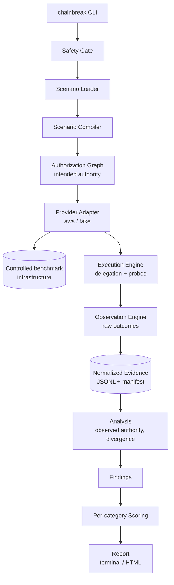

# CHAINBREAK

**An empirical benchmark for authorization behavior in delegated and agentic cloud systems.**

CHAINBREAK measures the gap between the authority a security policy *intended* to grant
and the authority a delegated workload *actually* holds when it executes.

> **Status: 0.1.0a0 — M0 (repository foundation), M1 (domain model + authorization graph),
> M2 (capability model + catalog), M3 (scenario language + compiler), M4 (CLI, configuration
> and the SafetyGate), M5 (provider Protocol + deterministic fake laboratory), M6 (evidence
> pipeline, redaction and sealing) and M7 (analysis, findings and the confidence gate)
> complete. M8 (AWS provider adapter)'s offline portion is complete; its real-account
> acceptance criteria are blocked pending an operator-provisioned AWS account and M9's
> Terraform.**
> The domain model, divergence algorithms, capability catalog, binding registry, operation
> allowlist, the full five-stage scenario validation pipeline and compiler, layered
> configuration resolution, the SafetyGate, the full `chainbreak` CLI, a real deterministic
> fake authorization engine (policy evaluation, session lifetimes, an injectable consistency
> model, all 10 capability bindings), the evidence pipeline (append-only sealed bundles,
> a `redact()` choke point at exactly 100% coverage, a SQLite run index, and a bounded reader
> and public-export scrub for untrusted bundles), the analysis pipeline (unanimity-based
> cell resolution, divergence/drift classification, the revocation-window and stale-authority
> math, the confidence gate, one rule per finding type, the negative-control detector, and
> `chainbreak analyze` turning a sealed bundle into `findings.json`), and the AWS provider
> adapter (preflight P1–P11, STS delegation for all five mechanisms, the ten capability probes
> with content verification and denial-message disambiguation, the mutation choke point,
> full-jitter retry, policy snapshotting) are implemented and verified (1227 passing tests;
> `core/` and `graph/` ~99% coverage, `capabilities/` 100%, `scenarios/` ~98%,
> `core/safety.py` and `evidence/redaction.py` exactly 100%, `providers/base/` 100%,
> `providers/fake/` ~99.7%, `analysis/` 97%, `providers/aws/` 93% **against moto and pure
> logic only** — no real AWS account exists, so no IAM behavior in `providers/aws/` has been
> confirmed against real AWS), and CI enforces lint, types, import boundaries, and security
> scans on every push. **No benchmark has been executed and no AWS experiment has been run**,
> so no number anywhere in this repository is a measurement.
> See [PROJECT_STATUS.md](PROJECT_STATUS.md) for the authoritative state of the project.

---

## The problem

Modern cloud systems hand authority down chains of identities. A human authorizes a
service, the service assumes a role, that role assumes another role, a workload receives
short-lived credentials, and somewhere at the end of the chain an autonomous process
performs an action. Every hop is supposed to *attenuate* authority — grant a subset, never
a superset — and every policy change is supposed to propagate promptly.

Those are assumptions. They are rarely measured.

CHAINBREAK asks two questions and answers them with reproducible evidence rather than
assertion:

1. **Does effective authority evolve the way the policy intended?**
   (intended authority vs. effective authority)
2. **Does authority at execution time still match authority at delegation time?**
   (delegation-time authority vs. execution-time authority)

## What CHAINBREAK is not

CHAINBREAK is a **defensive measurement instrument**, not an offensive tool. It operates
exclusively on infrastructure the operator creates for the benchmark, in an AWS account
the operator explicitly declares, using resources under a unique namespace prefix, with
only benign read/write/invoke probes against benchmark-owned markers.

It contains no capability for credential theft, authentication bypass, privilege
escalation against third parties, persistence, or monitoring evasion — and contributions
adding such capability will be rejected. See [SECURITY_MODEL.md](SECURITY_MODEL.md) for the
enforced invariants and [THREAT_MODEL.md](THREAT_MODEL.md) for the risk analysis.

## The five benchmark families

| Family | Question it answers | Primary measurement |
|---|---|---|
| **Scope attenuation** | Does a delegated identity ever hold authority beyond what the hop granted? | Set difference: observed capabilities − intended capabilities |
| **Delegation drift** | Across a multi-hop chain, where does effective authority first diverge from intent? | First divergence hop, per-hop gain/loss vectors |
| **Revocation propagation** | How long does previously granted authority remain effective after a policy change? | Interval between last success and first denial, with uncertainty bounds |
| **Stale authority** | Does a deferred task execute with current or historical authority? | Authority state classification at execution time |
| **Silent narrowing** | When authority is legitimately reduced, does the workload fail loudly or produce quiet partial output? | Failure transparency classification |

Each family ships with **negative controls** — intentionally misconfigured benchmark
scenarios whose divergence CHAINBREAK *must* detect. A benchmark that only ever reports
PASS has not demonstrated it can detect a failure.

## Architecture in one diagram



The core benchmark engine has **no dependency on AWS IAM semantics**. Scenarios are written
against abstract *capabilities* (`objectstore.read`), which a provider adapter maps to
provider actions (`s3:GetObject`) and probe implementations. That indirection is what makes
the v0.2+ roadmap (OIDC, SPIFFE, Azure, GCP) possible without rewriting v0.1.

## Intended workflow (v0.1 target)

```bash
chainbreak validate                                       # environment + account identity check
chainbreak scenario validate scenarios/scope-attenuation/basic.yaml
chainbreak infra plan   aws-sandbox
chainbreak infra apply  aws-sandbox
chainbreak run scenarios/scope-attenuation/basic.yaml     # writes an evidence bundle
chainbreak analyze  <run-id>
chainbreak report   <run-id> --format html
chainbreak infra destroy aws-sandbox
```

## Documentation map

**Start here**
- [ARCHITECTURE.md](ARCHITECTURE.md) — components, boundaries, data flow, extension points
- [docs/GLOSSARY.md](docs/GLOSSARY.md) — precise meaning of every term used in this repo
- [docs/CLAUDE_CODE_HANDOFF.md](docs/CLAUDE_CODE_HANDOFF.md) — implementation contract and per-milestone prompts

**Model specifications**
- [AUTHORIZATION_MODEL.md](AUTHORIZATION_MODEL.md) — authorization graph, divergence algorithms
- [CAPABILITY_MODEL.md](CAPABILITY_MODEL.md) — capability abstraction and provider mapping rules
- [SCENARIO_SPECIFICATION.md](SCENARIO_SPECIFICATION.md) — declarative scenario language v1alpha1
- [EVIDENCE_SCHEMA.md](EVIDENCE_SCHEMA.md) — evidence bundle format and redaction contract
- [SCORING_MODEL.md](SCORING_MODEL.md) — per-category results and why there is no composite score
- [AWS_PROVIDER_SPEC.md](AWS_PROVIDER_SPEC.md) — IAM/STS mechanics, probe design, Terraform contract

**Security and method**
- [SECURITY_MODEL.md](SECURITY_MODEL.md) — hard invariants and how each is enforced in code
- [THREAT_MODEL.md](THREAT_MODEL.md) — assets, threats, mitigations, residual risk
- [RESEARCH_METHODOLOGY.md](RESEARCH_METHODOLOGY.md) — hypotheses, variables, statistics, validity threats
- [EXPERIMENT_PROTOCOL.md](EXPERIMENT_PROTOCOL.md) — step-by-step protocol per benchmark family
- [TESTING.md](TESTING.md) — four-layer test strategy
- [REPRODUCIBILITY.md](REPRODUCIBILITY.md) — what must be recorded for a run to be reproducible

**Project management**
- [PROJECT_STATUS.md](PROJECT_STATUS.md) — durable source of truth
- [ROADMAP.md](ROADMAP.md) — v0.1 through v0.5
- [docs/DECISIONS.md](docs/DECISIONS.md) — ADR index
- [docs/implementation/MILESTONES.md](docs/implementation/MILESTONES.md) — M0–M19 index

## Requirements

- Python 3.12+
- Terraform 1.7+
- An AWS account **created for this benchmark** with no production workloads
- Estimated cost per full experiment suite: **under USD 1.00** (see [AWS_PROVIDER_SPEC.md](AWS_PROVIDER_SPEC.md#cost-model))

CI does **not** require AWS credentials. Unit and integration layers run entirely against a
deterministic fake provider.

## License

Apache-2.0. See [SECURITY.md](SECURITY.md) for vulnerability reporting and the scope of
acceptable use.
