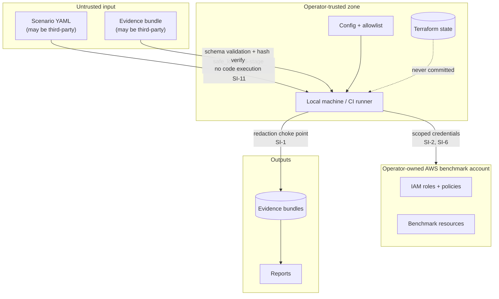

# CHAINBREAK Security Model

The hard invariants, and — more importantly — **where each one is enforced in code**. An
invariant that lives only in a document is a wish.

---

## 1. Posture

CHAINBREAK is a measurement instrument that necessarily holds cloud credentials, creates
identities, and mutates authorization policy. That combination is exactly the shape of a
tool that could do damage if it were wrong, careless, or misused. The security model
therefore has two jobs:

1. Make it structurally difficult for CHAINBREAK to affect anything outside its own
   benchmark namespace, **even when the operator makes a mistake**.
2. Make it structurally impossible for CHAINBREAK's outputs to disclose credentials.

Everything below serves one of those two goals.

## 2. Authorization basis

CHAINBREAK operates only where the operator holds authority. Before any run:

- The account ID must appear in an explicit `allowed_account_ids` allowlist in
  configuration. There is no wildcard and no "current account" default.
- The identities under test are created by the operator's own Terraform, in that account,
  for this purpose.
- Every resource touched carries the benchmark namespace.

There is no discovery mode, no scanning mode, no "point it at an account and see what
happens" mode, and no code path that enumerates identities the operator did not declare.
Requests to add one will be declined; see [SECURITY.md](SECURITY.md).

---

## 3. The ten invariants

Each has an ID, an enforcement point, and a test that proves the enforcement works. All
listed tests are merge gates.

### SI-1 — Secrets never enter evidence, logs, or reports

**Enforcement.** Three layers:
1. `core.secrets.SecretMaterial` — a type whose `__str__`, `__repr__`, `__format__`, and
   Pydantic serializer all raise `SecretSerializationError`. Credentials are only ever
   accessible via `.reveal()`, which is called in exactly two places
   (`providers/aws/session.py`, `providers/fake/session.py`).
2. `evidence.redaction.redact()` — the single serialization choke point. Every record
   passes through it. On detecting a secret pattern it **raises** and aborts the run.
3. A logging filter installed at CLI startup applying the same pattern set to every log
   record, including third-party loggers (botocore logs request headers at DEBUG).

**Patterns:** `(?:AKIA|ASIA)[0-9A-Z]{16}`, `aws_secret_access_key\s*[=:]`,
`x-amz-security-token`, `-----BEGIN [A-Z ]*PRIVATE KEY-----`, JWT shape
`eyJ[A-Za-z0-9_-]{10,}\.`, base64 runs ≥ 40 chars in credential-adjacent fields.

**Tests.** `tests/unit/test_redaction.py` — property-based: construct every domain model
with synthetic secrets injected into every string field, serialize a bundle, assert zero
matches and assert the run aborted where expected. Plus `test_logging_filter.py` asserting a
botocore DEBUG log containing a session token is scrubbed.

### SI-2 — Benchmark actions target only namespaced benchmark resources

**Enforcement.** `providers/base/namespace.py::assert_namespace(arn_or_ref, envelope)` is
called by: every probe before its API call, every mutation, and every delegation. In the AWS
adapter a **botocore `before-call` event hook** independently inspects every outbound
request's resource parameters and raises `NamespaceViolation` if any fails the regex. The
hook is belt-and-braces: it catches a probe that forgot to call `assert_namespace`.

**Tests.** `tests/unit/test_namespace_guard.py` (regex table, including near-miss ARNs from
other accounts and lookalike namespaces) and
`tests/integration/test_provider_contract.py::test_out_of_namespace_target_is_refused`.

### SI-3 — Provider adapters cannot silently broaden scenario capabilities

**Enforcement.** Each `ProviderCapabilityBinding` declares its complete `actions` list. A
botocore hook records every operation invoked during a probe; on probe completion the
executor asserts `invoked_operations ⊆ binding.actions`. Violation ⇒ the observation is
`ERROR_INFRASTRUCTURE` and the run aborts. Additionally the binding validator (run at
compile time) rejects a binding whose action set is not a subset of the capability's
declared `permitted_action_families`.

**Tests.** `tests/unit/test_binding_validator.py`, plus a deliberately over-broad binding
fixture in `tests/fixtures/bad_bindings.py` asserted to be rejected.

### SI-4 — Infrastructure has a deterministic cleanup path

**Enforcement.** All infrastructure is Terraform-managed with `force_destroy` where
required and explicit lifecycle rules. `chainbreak infra verify-clean` uses service-specific,
fail-closed enumerators for every provisioned service, including IAM roles and policies;
each candidate must have exact `Project=CHAINBREAK` and namespace tags, and any unknown or
failed enumerator is unsafe. Runtime-created state (inline policies added by mutations) is
tracked in a `runtime_mutations.jsonl` and reverted in a `finally` block; unreverted
mutations are listed loudly at run end with the exact revert commands.

**Tests.** `tests/integration/test_cleanup_contract.py` against the fake provider;
`tests/aws/test_verify_clean.py` in the opt-in AWS layer.

### SI-5 — Scenario execution requires explicit environment validation

**Enforcement.** `run` calls `SafetyGate.authorize(config, scenario, provider)` before
compiling. The gate is not bypassable: there is no `--skip-preflight`. `--dry-run` compiles
and prints the plan without a provider session at all.

**Tests.** `tests/unit/test_safety_gate.py` including a test asserting the CLI has no flag
that disables the gate (introspects the Typer command signature).

### SI-6 — Cloud account identity is verified before experiments

**Enforcement.** Preflight P1–P2 (see [AWS_PROVIDER_SPEC.md §2](AWS_PROVIDER_SPEC.md#2-preflight--the-gate-before-anything-else-happens)).
`GetCallerIdentity` is the first and, on mismatch, only AWS call made.

**Tests.** `tests/unit/test_preflight_ordering.py` asserts the recorded botocore call log
contains exactly one entry when the account check fails.

### SI-7 — Maximum experiment duration is enforceable

**Enforcement.** The run orchestrator arms a monotonic deadline at start.
Every phase boundary and every poll iteration checks it. On expiry: stop issuing new calls,
seal the bundle with `status: ABORTED_TIMEOUT`, run cleanup. `max_run_duration_seconds` has
a default (1800) and a hard ceiling (`14400`) that configuration cannot exceed.

**Tests.** `tests/integration/test_duration_abort.py` with a fake provider configured to
stall, asserting a sealed, analyzable partial bundle.

### SI-8 — Cost risk is bounded

**Enforcement.** Preflight P10 computes estimated cost from a static per-probe/per-call cost
table times the compiled plan's call count, and aborts above `max_estimated_cost_usd`
(default $1.00). The `benchmark-account` Terraform module provisions an AWS Budgets alarm.
DynamoDB is on-demand; log retention is explicit; S3 lifecycle expires scratch in 1 day.

**Tests.** `tests/unit/test_cost_estimator.py` — the estimator must be *conservative*: a
test asserts the estimate for a known plan is ≥ the actual call count times the table.

### SI-9 — No destructive capability in the default catalog

**Enforcement.** `capabilities/catalog.yaml` contains no capability with
`sensitivity: DANGEROUS`. The loader refuses to load a capability marked `DANGEROUS` unless
`--allow-dangerous-capabilities` is passed *and* the config sets
`allow_dangerous_capabilities: true` — two independent switches in two different places, so
neither a stale config file nor a copy-pasted command line is sufficient alone.

**Tests.** `tests/unit/test_catalog_safety.py` asserts the shipped catalog contains zero
`DANGEROUS` entries and that the double-switch is required.

### SI-10 — Logs are redacted at source

**Enforcement.** SI-1 layer 3. Additionally, `structlog`-style structured logging with an
allowlist of loggable field names; unknown fields are hashed rather than logged.

**Tests.** covered by `test_logging_filter.py`.

### SI-11 — Scenario files cannot execute code or reference real infrastructure

**Enforcement.** YAML loaded with `yaml.safe_load` only (never `yaml.load`, never
`!!python/object` tags — the loader is constructed with a restricted `SafeLoader` subclass
that rejects unknown tags outright). Scenario validation stage 5 rejects any literal ARN
(`arn:`), 12-digit account ID, or AWS region name anywhere in the document.

**Tests.** `tests/unit/test_scenario_safety.py` with malicious fixtures: YAML bombs
(billion-laughs — the loader caps alias expansion), python-object tags, embedded ARNs,
oversized documents, and deeply nested structures.

### SI-12 — The benchmark cannot revoke its own observability

**Enforcement.** `assert_role_is_benchmark_agent` in the mutation choke point refuses
`bootstrap` and `principal` as mutation targets.

**Tests.** `tests/unit/test_mutation_guard.py`.

---

## 4. Trust boundaries

Three boundaries carry real risk and are treated as adversarial:

- **Scenario files.** Treated as untrusted input even when locally authored, because the
  project intends scenarios to be shareable. This is why the format is declarative data and
  not a Python DSL ([ADR-003](docs/adr/ADR-003-declarative-scenario-format.md)).
- **Evidence bundles.** `chainbreak analyze` may be pointed at a bundle from elsewhere.
  Parsing is schema-validated, size-bounded, and never `eval`s anything. Report generation
  HTML-escapes every value from a bundle — a bundle is a plausible XSS vector into a
  generated HTML report, and the templating layer autoescapes by default with escaping
  explicitly re-asserted for any `|safe` usage (there are none).
- **Terraform state.** Contains resource identifiers and, depending on resources, sensitive
  attributes. Never committed; remote state, when used, must be an encrypted backend with
  restricted access.

---

## 5. Credential handling

| Credential | Source | Lifetime | Storage | Notes |
|---|---|---|---|---|
| Operator/CI | SSO, OIDC, or env | session | never written by CHAINBREAK | CI must use OIDC, not static keys |
| Bootstrap session | `AssumeRole` | ≤ 1 h | memory only | mutation + verification authority |
| Principal session | `AssumeRole` | ≤ 1 h | memory only | graph root |
| Agent sessions | `AssumeRole` (chained) | ≤ 1 h (capped) | memory only | the measurement subjects |

CHAINBREAK never writes a credential to disk, never sets `AWS_*` environment variables in
the parent process, and never caches sessions between runs. Every session is created inside
a context manager that zeroes its reference on exit. Python cannot guarantee memory
scrubbing, and the model does not pretend otherwise — this is recorded as residual risk R-2
in [THREAT_MODEL.md](THREAT_MODEL.md).

---

## 6. What CHAINBREAK will never implement

Stated so that the boundary is unambiguous to contributors and reviewers:

- Credential harvesting, discovery, or exfiltration of any kind.
- Authentication bypass, token forgery, or signature manipulation.
- Privilege escalation techniques against identities not created by the benchmark.
- Persistence mechanisms — backdoor roles, trust-policy implants, scheduled re-entry.
- Detection or monitoring evasion, including CloudTrail tampering or log suppression.
- Any operation against an account not in the operator's explicit allowlist.
- Automated exploitation of any finding.

A pull request adding any of these will be closed. If a capability is genuinely needed for
a *measurement* and superficially resembles one of the above, it must arrive with an ADR
explaining why the measurement cannot be obtained otherwise, and it must operate strictly
within the benchmark namespace.

---

## 7. Enforcement summary

| Invariant | Enforcement point | Merge-gate test |
|---|---|---|
| SI-1 secrets | `core/secrets.py`, `evidence/redaction.py`, log filter | `test_redaction.py`, `test_logging_filter.py` |
| SI-2 namespace | `providers/base/namespace.py` + botocore hook | `test_namespace_guard.py` |
| SI-3 no broadening | binding validator + operation allowlist hook | `test_binding_validator.py` |
| SI-4 cleanup | Terraform + `infra verify-clean` + revert `finally` | `test_cleanup_contract.py` |
| SI-5 gate required | `core/safety.py`, no bypass flag | `test_safety_gate.py` |
| SI-6 account check | `providers/aws/preflight.py` P1–P2 | `test_preflight_ordering.py` |
| SI-7 duration | run orchestrator deadline | `test_duration_abort.py` |
| SI-8 cost | preflight P10 + Budgets alarm | `test_cost_estimator.py` |
| SI-9 no destructive caps | catalog loader double switch | `test_catalog_safety.py` |
| SI-10 log redaction | logging filter | `test_logging_filter.py` |
| SI-11 scenario safety | restricted loader + validation stage 5 | `test_scenario_safety.py` |
| SI-12 self-observability | mutation choke point | `test_mutation_guard.py` |

CI runs this table as a checklist: `tests/unit/test_security_invariants.py` imports each
listed test module and asserts every SI id appears in at least one test's marker metadata.
An invariant without a test fails the build.
