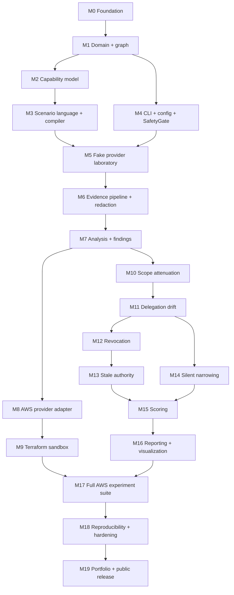

# CHAINBREAK Implementation Milestones

Twenty bounded milestones, M0–M19. Each has its own file with fourteen required sections, so
an implementation agent can execute one without inventing missing requirements.

Ready-to-copy Claude Code prompts are in [CLAUDE_CODE_HANDOFF.md](../CLAUDE_CODE_HANDOFF.md).

---

## Ordering, and why it differs from the brief

The original outline ran M0–M18 with the capability model at M4 and analysis late. Two
reorderings were made after dependency analysis, and both are load-bearing.

**Capability model moved before the scenario language.** Scenarios reference capability IDs
and the compiler resolves them against catalog and bindings (CAP-1, G-4). Building the
scenario compiler first would mean building it against a capability model that does not
exist, then reworking it.

**Analysis moved before the AWS adapter.** Every divergence algorithm, finding rule and
confidence gate can be developed and fully tested against the deterministic fake provider,
where ground truth is *known*. Building analysis after AWS would mean debugging analysis
logic and adapter behavior simultaneously, against an environment that costs money and takes
minutes per iteration. Getting analysis right offline first is the single largest schedule
and correctness win available.

One milestone was added: **M15 Scoring** was split out of the original combined
analysis-and-scoring milestone, because scoring has its own document, its own invariants
(min-not-mean confidence, `NOT_MEASURED` handling) and its own tests.

---

## Dependency graph

**M0–M7 and M10–M16 require no AWS account.** Only M8, M9, M17 do. That is deliberate: the
overwhelming majority of the system is built and verified offline.

---

## Index

| # | Milestone | Depends on | AWS? | Primary deliverable |
|---|---|---|---|---|
| [M0](milestones/M00-foundation.md) | Repository foundation and toolchain | — | no | CI green on an empty-but-correct repo |
| [M1](milestones/M01-domain-model.md) | Domain model and authorization graph | M0 | no | `core/`, `graph/`, divergence algorithms |
| [M2](milestones/M02-capability-model.md) | Capability model and catalog | M1 | no | `capabilities/`, binding validation |
| [M3](milestones/M03-scenario-language.md) | Scenario language, validation and compiler | M2 | no | `scenarios/`, `CompiledScenario` |
| [M4](milestones/M04-cli-config-safety.md) | CLI, configuration and SafetyGate | M1 | no | `chainbreak validate`, safety envelope |
| [M5](milestones/M05-fake-provider.md) | Fake provider deterministic laboratory | M3, M4 | no | `providers/base/`, `providers/fake/`, contract suite |
| [M6](milestones/M06-evidence-pipeline.md) | Evidence pipeline and redaction | M5 | no | Sealed bundles, `evidence/`, run index |
| [M7](milestones/M07-analysis-findings.md) | Analysis, findings and confidence | M6 | no | `chainbreak analyze` |
| [M8](milestones/M08-aws-adapter.md) | AWS provider adapter | M7 | **yes** | `providers/aws/`, probes, mutations |
| [M9](milestones/M09-terraform-sandbox.md) | Terraform AWS sandbox | M8 | **yes** | `infra/terraform/`, `infra` commands |
| [M10](milestones/M10-scope-attenuation.md) | Scope attenuation benchmark | M7 | no | Family A + negative controls |
| [M11](milestones/M11-delegation-drift.md) | Delegation drift benchmark | M10 | no | Family B, depth 2–6 |
| [M12](milestones/M12-revocation.md) | Revocation propagation benchmark | M11 | no | Family C, polling, interval math |
| [M13](milestones/M13-stale-authority.md) | Stale authority benchmark | M12 | no | Family D, paired credentials |
| [M14](milestones/M14-silent-narrowing.md) | Silent narrowing benchmark | M11 | no | Family E, task workers |
| [M15](milestones/M15-scoring.md) | Per-category scoring | M13, M14 | no | `scoring/`, six categories |
| [M16](milestones/M16-reporting.md) | Reporting and visualization | M15 | no | Terminal, Markdown, HTML, figures |
| [M17](milestones/M17-aws-experiment-suite.md) | Full AWS experiment suite | M9, M16 | **yes** | The first real measurements |
| [M18](milestones/M18-reproducibility-hardening.md) | Reproducibility and hardening | M17 | no | `compare`, export, archive |
| [M19](milestones/M19-portfolio-release.md) | Portfolio and public release | M18 | no | v0.1.0 tag |

---

## Rules that apply to every milestone

1. **Inspect before modifying.** Read the repository and the referenced documents first.
   Preserve existing work.
2. **Stay in scope.** Implement the assigned milestone. Do not refactor adjacent code, do
   not implement the next milestone, do not "improve" a design decision recorded in an ADR.
3. **Invariants are not negotiable.** ARCH-1, CAP-1/2, AUTH-1, G-1…G-5, PROV-1, INFRA-1/2,
   SI-1…SI-12, EV-1. Changing one requires an ADR, which requires stopping and asking.
4. **Tests are part of the milestone**, not a follow-up. Every acceptance criterion has a
   test that demonstrates it.
5. **Run the verification commands and paste the real output.** Not a description of it.
6. **Repair failures before reporting done.** A milestone with a failing test is not done.
7. **Update `PROJECT_STATUS.md`** — the milestone table, the current next action, and any
   new known issue or technical debt.
8. **Never claim an AWS experiment ran unless it ran against AWS**, with the run ID cited.

## Definition of done, common to all milestones

`ruff check .` clean · `ruff format --check .` clean · `mypy` clean · import boundaries clean ·
`pytest -m "unit or integration"` green · per-module coverage met · the milestone's own
acceptance criteria demonstrated by named tests · documentation updated where the milestone
changed behavior · `PROJECT_STATUS.md` updated.
